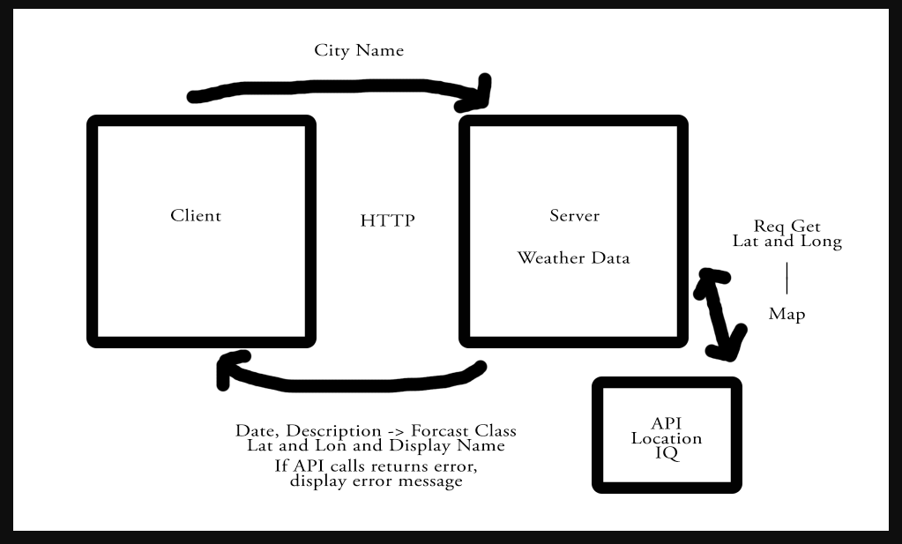
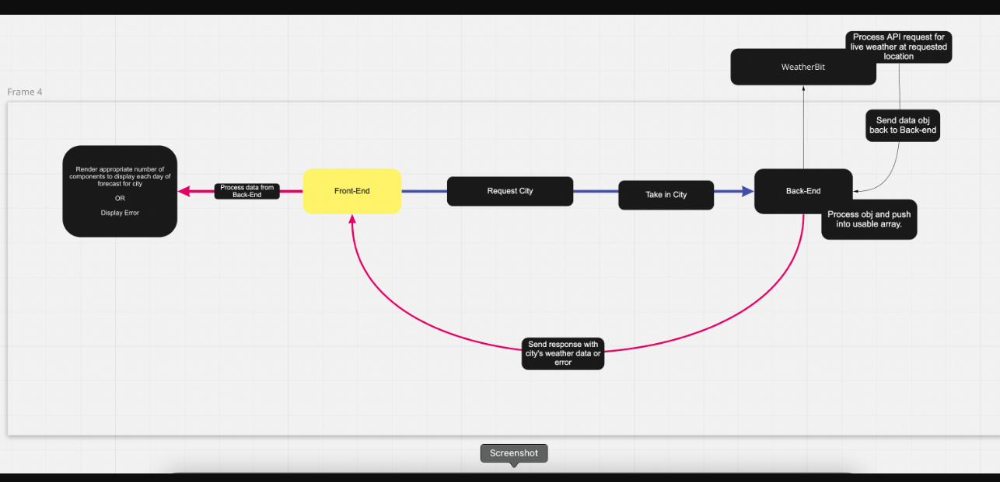

# City Explorer App
**Author**:Patrick Laurion
**Version**: 1.2.0

## Overview

## Getting Started

## Architecture

## Change Log

## Credit and Collaborations

## Lab-06
### Card 1
Name of feature: Trello card 1

Estimate of time needed to complete: 45 min

Start time: 1300

Finish time: 1330

Actual time needed to complete: 30 min

### Card 2
Name of feature: Trello card 2

Estimate of time needed to complete: 45 min

Start time: 1330

Finish time: 1430

Actual time needed to complete: 60 min

### Card 3
Name of feature: Trello card 3

Estimate of time needed to complete: 45 min

Start time: 1430

Finish time: 1630

Actual time needed to complete: 120 min

### Card 4
Name of feature: Trello card 4

Estimate of time needed to complete: 45 min

Start time: 1630

Finish time: 1730

Actual time needed to complete: 60 min

## Lab-07

### Card 1
Name of feature: Trello card 1

Estimate of time needed to complete: 45 min

Start time: 1300

Finish time: 1400

Actual time needed to complete: 60 min

### Card 2
Name of feature: Trello card 2

Estimate of time needed to complete: 90 min

Start time: 2030

Finish time: 2230

Actual time needed to complete: 120 min

### Card 3
Name of feature: Trello card 3

Estimate of time needed to complete: 45 min

Start time: 2230

Finish time: 2330

Actual time needed to complete: 60 min

## Lab-08

### Card 1
Name of feature: Trello card 1

Estimate of time needed to complete: 60 min

Start time: 1300

Finish time: 1410

Actual time needed to complete: 70 min

### Card 2
Name of feature: Trello card 2

Estimate of time needed to complete: 120 min

Start time: 1410

Finish time: 1550

Actual time needed to complete: 100 min

### Card 3
Name of feature: Trello card 3

Estimate of time needed to complete: 45 min

Start time: 1600

Finish time: 1700

Actual time needed to complete: 60 min
